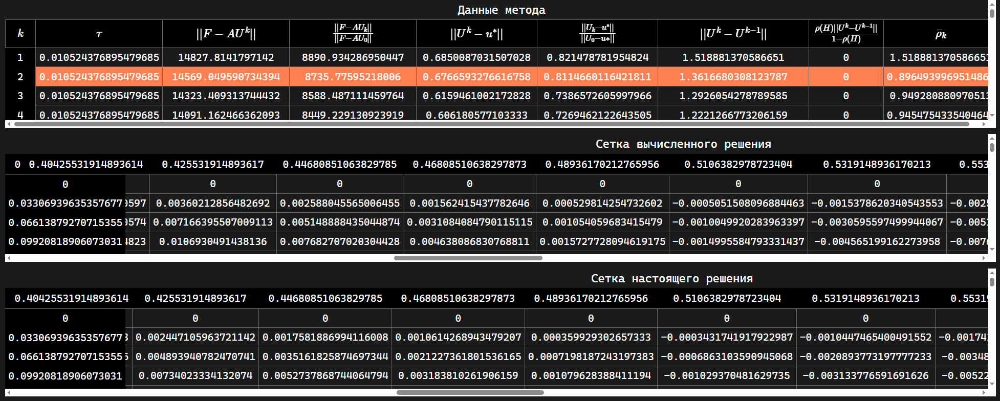

Description
-
### EN
This project contains solutions to problems from the sixth and seventh semesters of study at the university. Rust with Tauri and HTML, CSS, TS with Vite were used. pnpm as a package manager for JS-TS libraries.

Although Tauri as a frontend was not the best choice due to the use of interprocess communication. The main problem is that a large amount of data is calculated and displayed, which makes the json format a very bad solution considering the millions of numbers passed to the frontend. Other formats too. But personally, I needed to try the web stack at least once for solving problems, and from this side it was a great choice. JS gave simplicity and a great visual library Plotly. Soon switched to TS, as it was necessary to clarify the JS code.

Vite made it easy to change HTML and CSS while the program was running.

### RU
В этом проекте содержатся решения задач шестого и седьмого семестров обучения в университете. Были ипользованы Rust с Tauri и HTML, CSS, TS с Vite. pnpm как пакетный менеджер для библиотек на JS-TS.

Хотя Tauri как frontend не был лучшим выбором из-за использования межпроцессного взаимодействия. Основная проблема заключается в том, что вычисляется и отображается большой объем данных, что делает формат json очень плохим решением с учётом миллионов чисел передаваемых на фронтенд. Но лично мне нужно было хотя бы раз попробовать веб-стек для решения задач, и с этой стороны это был отличный выбор. JS дал простоту и прекрасную визуальную библиотеку Plotly. Вскоре перешел на TS, так как нужно было внести ясность в код JS.

Vite позволил легко изменять HTML и CSS прямо в ходе работы программы.

# Libraries 
### JS-TS
MathJax, Plotly, 
### Rust
Tauri, Peroxide, meval, Serde, Serde_json, thiserror, csv 

6 Term
-
1. Projection methods for solving second-order ODEs:  Ritz, Jacobi polynomials
2. Non-stationary equations with one spatial variable, stability study: Explicit, Purely implicit, Implicit, Symmetrical schemes.

7 Term
-
1. Difference schemes for elliptic equations, iterative methods for solving grid equations: Zeidel, Simple iteration, Simple iteration with optimal parameter methods

2. Two-layer iterative schemes: Upper relaxation, Chebyshevsky Iteration, Alternating Triangular, Alternating Triangular with Chebyshevsky parameters methods
3. Method of establishing the solution of the Dirichlet problem for the Poisson equation: Alternating direction scheme
4. Hyperbolic equation
5. Parallel computing: Parallel Alternating direction scheme
6. Parallel computing: Multithreading Alternating direction scheme

---

### Real solution - Calculated solution

### Absolute errors - Relative errors
